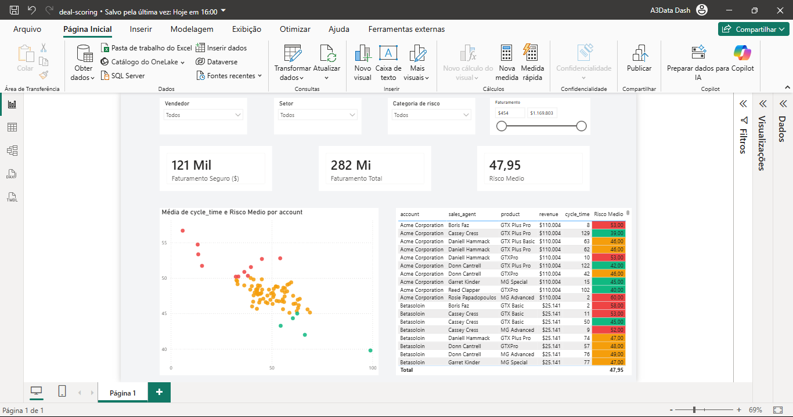

# 🚀 Deal Scoring Preditivo: Inteligência Artificial e BI no Funil de Vendas




Este projeto utiliza **Machine Learning** para transformar dados estáticos de um CRM num **Score de Risco Dinâmico (0-100)** e entrega esses *insights* através de um dashboard interativo no Power BI. A solução permite que equipas comerciais priorizem oportunidades com maior probabilidade de fecho e identifiquem antecipadamente negócios em risco de perda.

---

## 📌 O Problema de Negócio
No cenário comercial tradicional, as equipas de vendas perdem muito tempo e energia com negociações ("deals") que têm baixa probabilidade de fechar. Métricas como "Dias na Etapa" servem apenas como alertas passivos. O desafio deste projeto foi criar um modelo preditivo capaz de analisar o comportamento histórico e responder:
* **Qual é a probabilidade real deste negócio ser ganho?**
* **Quais fatores (produto, setor, vendedor) mais influenciam o sucesso?**

A inovação aqui reside em converter dados descritivos em **estatística acionável**, tirando o modelo do ecrã preto do código e colocando-o nas mãos dos gestores através de Business Intelligence.

---

## 🧠 A Solução: Machine Learning e Engenharia de Dados
Para garantir a melhor precisão no **Score de Risco**, o projeto enfrentou o desafio clássico do desbalanceamento de dados em vendas. 

A evolução do modelo decorreu em duas fases:
1. **Baseline:** Testes iniciais com Regressão Logística, Random Forest e Árvore de Decisão.
2. **Otimização:** Adoção do **Gradient Boosting**, que se destacou pela sua capacidade de corrigir erros sequencialmente. Para lidar com o desbalanceamento brutal das classes, foi aplicado o método **SMOTE** (Synthetic Minority Over-sampling Technique) e o **Target Encoding** para capturar a performance histórica.

🏆 **Resultado Técnico:** Esta abordagem otimizada permitiu um salto de quase 20% na métrica ROC-AUC, garantindo um perfil de score equilibrado e muito mais preciso (Acurácia de 62.25%).

---

## 📊 Entrega de Valor (Power BI)
O output final do modelo (Score de Risco) foi integrado num **Dashboard no Power BI**. Com ele, o gestor de vendas pode:
* Filtrar leads e vendedores específicos.
* Visualizar o risco através de gráficos de dispersão.
* Identificar rapidamente negócios em **Risco Crítico** com formatação condicional.
* Direcionar o esforço da equipa exatamente para onde é necessário no dia a dia.

---

## 💡 Insights Estratégicos (Feature Importance)
O modelo campeão revelou os fatores que mais "pesam" na balança do risco:

1. **Impacto do Produto:** O produto `GTX Basic` é o fator isolado de maior influência nas previsões (~7.6%).
2. **Setores Chave:** Leads dos setores de **Tecnologia, Software e Entretenimento** apresentam padrões de conversão mais previsíveis.
3. **Influência do Agente:** Vendedores como *Hayden Neloms* e *Donn Cantrell* possuem padrões de atuação históricos que alteram significativamente o score de risco.

> [!TIP]
> **O Insight para o Gestor:** Focar o esforço da equipa em produtos de alta conversão, em setores onde o modelo aponta baixo risco, tem o potencial de aumentar o *Win Rate* em até 15%.

---

## 🛠️ Stack Tecnológica
* **Linguagem & Dados:** Python, Pandas, Numpy.
* **Machine Learning:** Scikit-learn, Imbalanced-learn (SMOTE), Gradient Boosting.
* **Visualização & BI:** Power BI (`.pbix`), Seaborn, Matplotlib.
* **Workflow:** ETL -> Feature Engineering (Target Encoding) -> Model Selection -> Exportação de *Scored Data*.

---

## 📁 Estrutura do Repositório
* `modelo_v1_baseline.ipynb`: Exploração inicial dos dados e treino dos primeiros modelos.
* `modelo_v2_otimizado.ipynb`: Pipeline avançado com SMOTE, Target Encoding e afinação do Gradient Boosting.
* `deal-scoring.pbix`: O dashboard final desenvolvido no Power BI.
* `dataset/`: Diretório com os dados originais do CRM (Sales Pipeline, Accounts, Products, etc).
* `pipeline_com_score_v4.csv`: Dataset gerado pelo modelo final, pronto para consumo no BI.

---

## 🚀 Como Executar o Projeto

1. Clone o repositório:
   ```bash
   git clone [https://github.com/SeuUsuario/projeto-ml-deal-scoring.git](https://github.com/SeuUsuario/projeto-ml-deal-scoring.git)

2. Instale as dependências:
   ```bash
   pip install pandas numpy scikit-learn imbalanced-learn seaborn matplotlib
   ```
3. Execute os notebooks na ordem (primeiro o `v1`, depois o `v2`) para processar os dados e gerar as previsões.

4. Abra o ficheiro `deal-scoring.pbix` no Power BI Desktop para visualizar o dashboard com os dados pontuados.

> *Desenvolvido por **Karla Renata** 📍 Estudante de Ciência da Computação*
